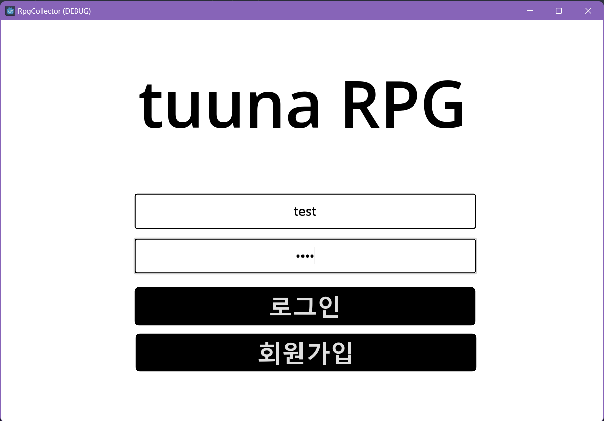

### 컴투스 서버캠퍼스 1기 
김수창

## Images 



## API 목록
### Login API

1. username과 password를 입력받아 AccountDB의 users 테이블 검증
2. 검증된 유저에 대해 인증토큰 발급 및 redis에 해당 유저 useranem : token 형식 저장

**Database**

```csharp
AccountDB 
1. users - GET

Redis AccountDB 
1. UserName - RedisUser - INSERT
```

**Path**

```csharp
POST /Login
```

**Request**

```csharp
public class LoginRequest
{
    [Required]
    [LoginUserName]
    public string UserName { get; set; }

    [Required]
    [LoginUserPassword]
    public string Password { get; set; }
}
```

**Response**

```csharp
public class LoginResponse
{
    public ErrorState Error { get; set; }
    public string UserName { get; set; }
    public string AuthToken { get; set; }
}
```

### Register API

1. username과 password를 입력받아 디비서버 검증 
2. 유효한 요청이라면 AccountDB에 저장 및 GameDB에 players테이블에 userId를 참조하는 행 삽입 
3. GameDB의 init_player_items와 init_player_state의 테이블을 참고하여 초기 데이터 로드
4. 플레이어의 정보는 players 테이블에 저장, player item은 player_items에 저장 
5. 플레이어 생성 실패시 accountDB에서 해당 유저 정보 롤백(삭제)

**Database**

```csharp
AccountDB 
1. users - INSERT

GameDB 
1. init_player_items - GET 
2. init_player_state - GET 
3. player_items - INSERT
4. players - INSERT
```

**Path** 

```csharp
POST /Register
```

**Request** 

```csharp
public class RegisterRequest
{
    [Required]
    [RegisterUserName]
    public string UserName { get; set; }

    [Required]
    [RegisterUserPassword]
    public string Password { get; set; }
}
```

**Response** 

```csharp
public class RegisterResponse
{
    public ErrorState Error {  get; set; }
}
```

### Logout API

1. 요청받은 헤더에 포함된 username을 기반으로 Redis에 저장된 유저정보 삭제

**Database** 

```csharp
1. Account Redis DB - DELETE
```

**Path**

```csharp
POST /Logout 
```

**Request** 

```csharp
public class LogoutRequest
{
}
```

**Response** 

```csharp
public class LogoutResponse
{
    public ErrorState Error { get; set; }
}
```

### Notice API

1. Redis에 저장된 모든 공지정보를 넘긴다. 

**Database** 

```csharp
Notice Redis DB - GET
```

**Path**

```csharp
POST /Notice
```

**Request**

```csharp
public class NoticeGetRequest
{
}
```

**Response**

```csharp
public class NoticeGetResponse
{
    public ErrorState Error { get; set; }
    public Notice[] NoticeList { get; set; }
}
```

### MailOpen API

1. 해당 우편함을 처음열었는가, 몇번 페이지를 볼것인가를 기반으로 삭제되지 않았거나 30일 기간이 지나지 않은 메일을  userId기반으로 불러와서 최대 20개 클라이언트에 전송

**Database** 

```csharp
Redis Account DB - GET

GameDB 
1. mailbox - GET 
```

**Path** 

```csharp
POST /Mail/Open
```

**Request**

```csharp
public class MailOpenRequest
{
    [Required]
    public bool? IsFirstOpen { get; set; }

    [Required]
    public int? PageNumber { get; set; }
}
```

**Response**

```csharp
public class OpenMail
{
    public string Title { get; set; }
    public int SenderId { get; set; }
    public string SendDate { get; set; }
    public int MailId { get; set; }
}
public class MailOpenResponse
{
    public ErrorState Error { get; set; }
    //public Mailbox[] Mails { get; set; }
    public int TotalPageNumber { get; set; }
    public OpenMail[] Mails { get; set; }
}
```

### MailRead API

1. 열람하려는 메일에 대해서 삭제되었는지, 소유권자인지, 유효기간이 지났는지를 확인한다 
2. 문제가 없다면 userId를 기반으로 불러온다. 
3. 그리고 해당 MailId를 기반으로 데이터베이스에 읽음(isRead)표시를 진행한다. 

**Database** 

```csharp
Redis Account DB - GET

GameDB 
1. mailbox - GET / UPDATE
```

**Path**

```csharp
POST /Mail/Read
```

**Request**

```csharp
public class MailReadRequest
{
    [Required]
    public int MailId { get; set; }
}
```

**Response**

```csharp
public class MailReadResponse
{
    public ErrorState Error { get; set; }
    public Mailbox Mail { get; set; }
    public MailItem? MailItem { get; set; }
}
```

### MailGetItem API

1. 열람하려는 메일이 유효기간을 지났는지, 삭제되었는지, 소유권이 누군지확인한다 
2. 해당 메일이 아이템이 동봉되어있는지 확인한다 
3. 해당 메일에 동봉된 아이템을 이미 수령하였는지또한 확인한다. 
4. 문제가 없다면 해당 MailId와 연결되어있는 Item을 Quantity에 맞게 플레이어에게 추가
5. 정상적으로 추가가 되었다면 hasReceived를 1로 둔다. 
6. 만약 플레이어에게 해당 메일 아이템 추가를 실패한다면 메일의 아이템은 수령하지 않은것으로 롤백처리한다. 

**Database**

```csharp
Redis Account DB - GET

GameDB
mailbox - GET
mail_item - GET / UPDATE
player_items - INSERT
```

**Path** 

```csharp
POST /Mail/Item
```

**Request**

```csharp
public class MailGetItemRequest
{
    [Required]
    public int MailId { get; set; }
}
```

**Response**

```csharp
public class MailGetItemResponse
{
    public ErrorState Error { get; set; }
}
```

### MailDelete API

1. 해당 메일이 유효기간이 지났는지, 소유권을 지니는지, 이미 삭제되었는지를 확인한다. 
2. 문제가 없다면 삭제를 진행한다. 이때 실제로 삭제를 하는것이 아닌 isDeleted 플래그를 1로 둔다. 

**Database** 

```csharp
Redis Account DB - GET

GameDB 
mailbox - GET / UPDATE
```

**Path** 

```csharp
POST /Mail/Delete
```

**Request** 

```csharp
public class MailDeleteRequest
{
    [Required]
    public int MailId { get; set; }
}
```

**Response** 

```csharp
public class MailDeleteResponse
{
    public ErrorState Error { get; set; }
}
```

### Attendance API

1. 오늘날짜를 불러와서 오늘 출석 유무를 확인한다. 
2. 출석을 하지 않았다면 어제자 날짜를 가지고와 연석출석 유무를 확인한다. 
3. 연속출석유무는 아래의 로직과 같다 
    1. 어제자 출석로그가 없다면 연속출석은 1로 반환 
    2. 어제가 출석로그가 존재한다면 어제의 연속출석일수를 가지고와 +1을 한 후 반환
4. 연속출석일수를 인자로 출석을 진행한다.
5. 연속출석일수에 맞춰 보상을 플레이어의 메일로 전송한다. 

**Database** 

```csharp
Redis Account DB - GET

GameDB
mailbox - INSERT
mail_item - INSERT
master_attendance_reward - GET
master_item_info - GET
player_attendance_log - GET / INSERT
```

**Path** 

```csharp
POST /Attendance
```

**Request**

```csharp
public class AttendanceRequest
{
}
```

**Response**

```csharp
public class AttendanceResponse
{
    public ErrorState Error { get; set; }
}
```

### Enchant API

1. 요청받은 playerItemId가 userId의 소유권인지 존재하는지 확인한다. 
2. 요청받은 playerItemId를 기반으로 플레이어의 아이템을 디비에서 가지고온다. 
3. 해당 플레이어 아이템의 ItemId를 기반으로 Master Item을 가지와 해당 아이템의 타입이 강화를 진행할 수 있는 타입인지 확인한다. 
4. 플레이어의 아이템에 포함된 현재 강화 단계와 Master Item의 최대 강화횟수와 비교하여 미만이라면 강화를 진행한다. 
5. 위의 모든 조건이 만족되면 강화를 진행한다. 강화시 강화정보 마스터 데이터를 참조하여 현재 강화단계별 퍼센트를 확인한다. 
6. 만약 강화에 실패한다면 해당 아이템은 삭제처리 한다. 
7. 위의 단계가 진행된다면 강화로그를 남긴다. 

**Database**

```csharp
Redis Account DB - GET

GameDB 
master_item_info - GET
master_item_attribute - GET 
master_enchant_info - GET
player_items - GET / UPDATE / DELETE
player_enchant_log - INSERT

```

**Path** 

```csharp
POST /Enchant
```

**Request**

```csharp
public class EnchantExecuteRequest
{
    [Required]
    public int PlayerItemId { get; set; }
}
```

**Response** 

```csharp
public class EnchantExecuteResponse
{
    public ErrorState Error { get; set; }
    public int Result { get; set; }
}
```

### Package API

1. 요청된 영수증ID와 패키지 ID의 유효성을 검사한다. 
    1. 중복되지 않은 영수증 ID인가 
    2. 존재하는 패키지 ID인가 
2. 위의 조건이 일치한다면 영수증 디비에 해당 요청을 기록한다. 
3. 패키지ID에 맞는 item과 quantity를 item이 포함된 메일을 각 각 전송한다. 

**Database** 

```csharp
Redis Account DB - GET

GameDB 
master_package_info - GET 
player_payment_info - GET / INSERT
mailbox - INSERT
mail_item - INSERT 
```

**Path** 

```csharp
POST /Package/Buy
```

**Request**

```csharp
public class PackageBuyRequest
{
    [Required]
    public int ReceiptId { get; set; }
    [Required]
    public int PackageId { get; set; }
}
```

**Response** 

```csharp
public class PackageBuyResponse
{
    public ErrorState Error { get; set; }
}
```

### MasterItemInfo API 
1. 요청받은 itemId의 master data를 넘겨줌 

**Database** 
```csharp
master_item_info - GET
```

**Path** 
```csharp
POST /Master/Item  
```

**Request**
```csharp
public class MasterItemGetInfoRequest
{
    public int ItemId { get; set; }
}
```

**Response**
```csharp
public class MasterItemGetInfoResponse
{
    public ErrorState Error { get; set; }
    public MasterItem MasterItem { get; set; }
    public string AttributeName { get; set; }
    public string TypeName { get; set; }
}
```

### MasterAttendanceReward API  
1. 출석보상 리스트를 반환함

**Database** 
```csharp
master_attendance_info- GET
```

**Path** 
```csharp
POST /Master/Attendance  
```

**Request**
```csharp 
public class MasterAttendanceInfoRequest
{
}
```

**Response**
```csharp
public class MasterAttendanceInfoResponse
{
    public ErrorState Error { get; set; }
    public MasterAttendanceReward[] AttendanceRewards { get; set; }
}
```

### AttendanceGetLog API 
1. userId기준 마지막 연속출석 날짜를 반환함

**Database** 
```csharp
player_attendance_log- GET
```

**Path** 
```csharp
POST /Attendance/Log  
```

**Request**
```csharp 
public class AtendanceGetLogRequest
{
}
```

**Response**
```csharp
public class AttendanceGetLogResponse
{
    public ErrorState Error { get; set; }
    public int SequenceDayCount { get; set; } 
}
```

### Player Items Get API
1. userId기준 소유한 아이템을 반환함

**Database** 
```csharp
player_items - GET
```

**Path** 
```csharp
POST /Inventory
```

**Request**
```csharp 
public class PlayerInventoryGetRequest
{
}
```

**Response**
```csharp
public class PlayerInventoryGetResponse
{
    public ErrorState Error { get; set; }
    public PlayerItem[]? Items { get; set; }
}
```

### Player Items Detail GET API
1. userId기준 소유한 아이템의 상세설명을 반환함

**Database** 
```csharp
player_items - GET
master_enchant_info - GET
```

**Path** 
```csharp
POST /Inventory/Item
```

**Request**
```csharp 
public class PlayerItemDetailGetRequest
{
    public int PlayerItemId { get; set; }
}
```

**Response**
```csharp
public class PlayerItemDetailGetResponse
{
    public ErrorState Error { get; set; }
    // EnchantCount의 가치만큼 해당 값 수정
    public MasterItem ItemPrototype { get; set; }
    public AdditionalState PlusState { get; set; }
    public int EnchantCount { get; set; }
}
```

### Package Show API
1. 인앱결제 상품 목록을 반환함

**Database** 
```csharp
master_package_payment
```

**Path** 
```csharp
POST /Package/Show
```

**Request**
```csharp 
public class PackageShowRequest
{
}
```

**Response**
```csharp
public class PackageShowResponse
{
    public ErrorState Error { get; set; }
    public MasterPackagePayment[] PackagePayment { get; set; }
}
```

### Master Enchant Info Get API
1. 요청받은 플레이어 아이템 ID기준으로 강화 능력치를 가지고 옴

**Database** 
```csharp
master_package_payment
```

**Path** 
```csharp
POST /Package/Show
```

**Request**
```csharp 
public class EnchantInfoGetRequest
{
    [Required]
    public int PlayerItemId { get; set; }
}
```

**Response**
```csharp
public class EnchantInfoGetResponse
{
    public ErrorState Error { get; set; }
    public int CurrentEnchantCount { get; set; }
    public int NextEnchantCount { get; set; }
    public int Percent { get; set; }
    public int IncreasementValue { get; set; }
    public int ItemId { get; set; }
    public int PlayerItemId { get; set; }
}
```

### 2차 피드백  
2차 피드백  
[해결]1. 중복로그인 체크하지 말고 -> 새로운값으로 토큰 발급하고 갱신  + TTL 추가   
[해결]2. 컨트롤러마다 Request, Response 사용하기    
[해결]3. Response에 true false + message가 아닌 Error코드 정의해서 전송   
[해결]4. Document폴더만들어서 MD파일들 넣기    
[해결]5. 패스워드 유효성 검사는 로그인 컨트롤러에서    
[해결]6. Json으로 반환안해도 됨 -> 알아서 모델 매칭 해주는듯    
[해결]7. Redis에 User저장할때 해쉬로 X -> 간단하게 username - authToken - ttl 설정하기    
[해결]8. Insert한 row의 auto_increase한 값 가지고 오는법 찾기   
[해결]9. [FromBody] 에러뜨는 이유 알기    
-> [ApiController] : 모델 바인딩     
[해결]10. ModelState.Isvalid 없어도 되는지 확인    
[해결]11 계정은 만들어졌지만 CreatePlayer 실패했을 때 Undo기능 추가하기   
[해결]12. 에러 로깅   
[해결]13. SetupSaltAndHash 나누기    
[해결]14. Database 커넥터 각 파일에 그냥 넣기   
[보류]15. 토큰 유니코드 문제 바이트에서 스트링으로 해결하기   
[보류]16. Register시 try - catch 잘생각해보기 - 유저있는지 없는지 확인하는데 Error발산 좀 그럼    
-> Insert시 에러발생 말고 다른 메소드 있는지 찾아보기   
-> INSERT IGNORE INTO 를 사용하려고 만들어진 rawSQL을 수정해서 다시 컴파일하고 실행하려는 방법을 찾던 도중 실패   